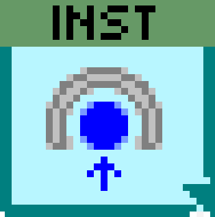

# Instrument Framework

<p align="center">
  
</p>

Framework developed by the [LevyLab](http://www.levylab.org) research group at the [University of Pittsburgh](http://www.pitt.edu).


An Instrument developed using this framework will have access to the following capabilities:
- Configuration
  - Read and Write configuration files.
- Hardware Abstraction
  - Interface with hardware in a dedicated process
  - Virtual Instrument layer (*In Development*)
- Data Logging
  - Log to a postgreSQL database
- Remote API allowing external programs to control compiled instances of the application and remotely across a network
  - Default: [ZeroMQ](https://zeromq.org/) and [JSON-RPC 2.0](https://www.jsonrpc.org/specification) allow for cross-platform messaging (e.g. Python <--> LabVIEW).
  - Option [National Instruments' Simple Messaging Library (STM)](http://www.ni.com/tutorial/53683/en/) is an optional protocal
- User Interface
  - Default: Inherit from SMO UI.lvclass
  - Option: Embedded Subpanel UI framework ([MAUI](https://github.com/levylabpitt/MAUI-Engine)) (*In Development*)

Instrument Framework makes extensive use of [JKI State Machines](https://github.com/JKISoftware/JKI-State-Machine) and [JKI State Machine Objects](https://github.com/JKISoftware/JKI-State-Machine-Objects).

## Getting Started

#### 1. Requirements
- LabVIEW 2019 (*32 bit*)
- Install the **Instrument Framework** package using [VI Package Manager](https://vipm.jki.net/)

#### 2. Initialize your Instrument Framework Project Repository
0. Navigate to [Instrument-Framework-Template](https://github.com/levylabpitt/Instrument-Framework-Template) and click **Use this template**.


1. Select the account you want to own the repository using the **Owner** drop-down menu.
2. **Nam**e your repository
3. Add an (optional) **description**.
4. Choose a repository **visibility**
5. Selecting **Include all branches** will configure [Git-flow](https://www.atlassian.com/git/tutorials/comparing-workflows/gitflow-workflow) by default.
6. Click **Create repository from template**


#### 3. Repository Description

The following files and folders are creeated from the Instrument Framework Template

```Batchfile
Instrument X\                     :: Project Root
Instrument X\build support\       :: Files used to build VIP and EXE 
Instrument X\lvsrc\               :: Instrument X.lvproj and all other LabVIEW code goes here
Instrument X\.gitattributes       :: Tell git to treat certain text files as if they are binary
Instrument X\.gitignore           :: Tell git which files and folders to ignore
Instrument X\LICENSE              :: LICENSE file. Default is BSD-3 Clause
Instrument X\README.md            :: Your project README
```

The following folders are **not** created by the Template (because they are initially empty folders), but they are important for building to run smoothly.

```Batchfile
Instrument X\builds               :: builds root
Instrument X\builds\7z Install
Instrument X\builds\Application   :: Application (exe) Destination Directory
Instrument X\builds\Installer     :: Installer Destination Directory
Instrument X\builds\Latest
Instrument X\builds\Package       :: VIPB Build Output Directory
```

#### Build spec files
It is important to define and use canonical name for your project right away. In this tutorial I am calling it **Instrument X**.
This is important when setting up your build spec files:
- VIPB file
  - Used for building VIP Package for API and code reuse in LabVIEW
  - `"Product Name" = "Instrument X"`
  - `"Build Output" = "Instrument X\builds\Package"`
- Application (exe) build spec
  - `"Build specification name" = "Instrument X Application"`
  - `"Application (exe) Destination" = "Instrument X\builds\Application"`
- Installer build spec
  - `"Build specification name" = "Instrument X Installer"`
  - `"Installer Destination" = "Instrument X\builds\Installer"`


#### 4. Create SMOs
Use the SMO Editor to create two SMOs using the **Instrument.Template** and **Instrument.Template UI** templates.


#### 5. Modify SMOs
Modify the two new SMOs to refer to each other rather than the template SMOs.


#### 6. Write your code!
- Start with the overrides provided in the template SMOs.
- Add code to interface with your hardware.
- Define your relevant methods (set inheritance to existing Instrument types).
- Create a dope UI.
- *Have Fun!*

## Documentation

Please read the [documentation](documentation).

## Contributing

Please contact [Patrick Irvin](p.irvin@levylab.org)

## License

[BSD-3](https://opensource.org/licenses/BSD-3-Clause)
