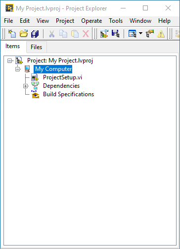

# Lab Instrument Framework

  

Framework developed for the [LevyLab](http://www.levylab.org) research group at the [University of Pittsburgh](http://www.pitt.edu).

An Instrument developed using this framework will have access to the following capabilities:
- Methods for reading and writing configuration settings.
- A hardware abstraction layer (HAL) for interfacing with hardware.
- Data logging: poll and log instrument configuration and settings to DSC database
  - In development: logging to Amazon AWS
- Defines an API to allow external programs to control compiled instances of the application and remotely across a network
  - Currently implemented using [National Instruments' Simple Messaging Library (STM)](http://www.ni.com/tutorial/53683/en/), however a cross-platform protocol is being developed using [0MQ](https://zeromq.org/).
- User interface framework.
  - In development: an embedded subpanel UI framework ([MAUI](https://github.com/levylabpitt/MAUI-Engine))

The LevyLab Instrument Framework makes extensive use of [JKI State Machines](https://github.com/JKISoftware/JKI-State-Machine) and [JKI State Machine Objects](https://github.com/JKISoftware/JKI-State-Machine-Objects).

## Installation

Unless otherwise noted, all software is written with LabVIEW 2016. Please install using the [VI Package Manager](https://vipm.jki.net/)

## Documentation

Please read the [documentation](documentation).

## Initialize a Project

A set of project templates are provided, with an overview of setting up your first project outlined in this [video](http://www.youtube.com/watch?v=0eFYXP9WFVs).

1. Create a Project in LabVIEW using the "LevyLab Instrument" template.

  

  

2. Close the project and browse to your newly created project folder:

  

3. Run the VI "ProjectSetup.vi".

  

4. The following default folder structure is created:

  

    Your Project\
    Your Project\builds\7z Install
    Your Project\builds\Application *-- Set your Application's Destination directory to this*
    Your Project\builds\Installer *-- Set your Installer's Destination directory to this*
    Your Project\builds\Latest
    Your Project\builds\Package *-- Set your VIPB Build Output Directory to this*
    Your Project\lvsrc *-- *.lvproj and all other LabVIEW code goes here*
    LICENSE
    README.md

    *Important:*
    Define a canonical name for your project right away. In this tutorial I am calling it "My Project".
    This is important when setting up your build spec files:
    - VIPB file: set "Product Name" = "My Project"
    - Application (exe) build spec: set "Build specification name" = "My Project Application"
    - Installer build spec: set "Build specification name" = "My Project Installer"
    

  

5. Use the SMO Editor to create two SMOs using the LevyLab Instrument and LevyLab Instrument UI templates.
6. Modify the two new SMOs to refer to each other rather than the template SMOs.
7. Write your code! Start with the overrides provided in the template SMOs. Add code to interface with your hardware. Define your relevant methods (set inheritance to existing Instrument types). Create a dope UI. More info coming soon! I promise!

## Contributing

Please contact [Patrick Irvin](p.irvin@levylab.org)

## License

[BSD-3](https://opensource.org/licenses/BSD-3-Clause)
