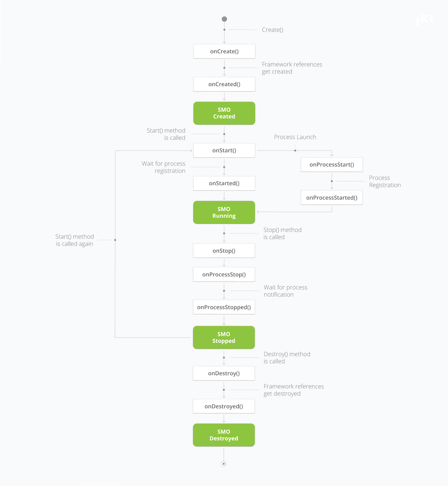
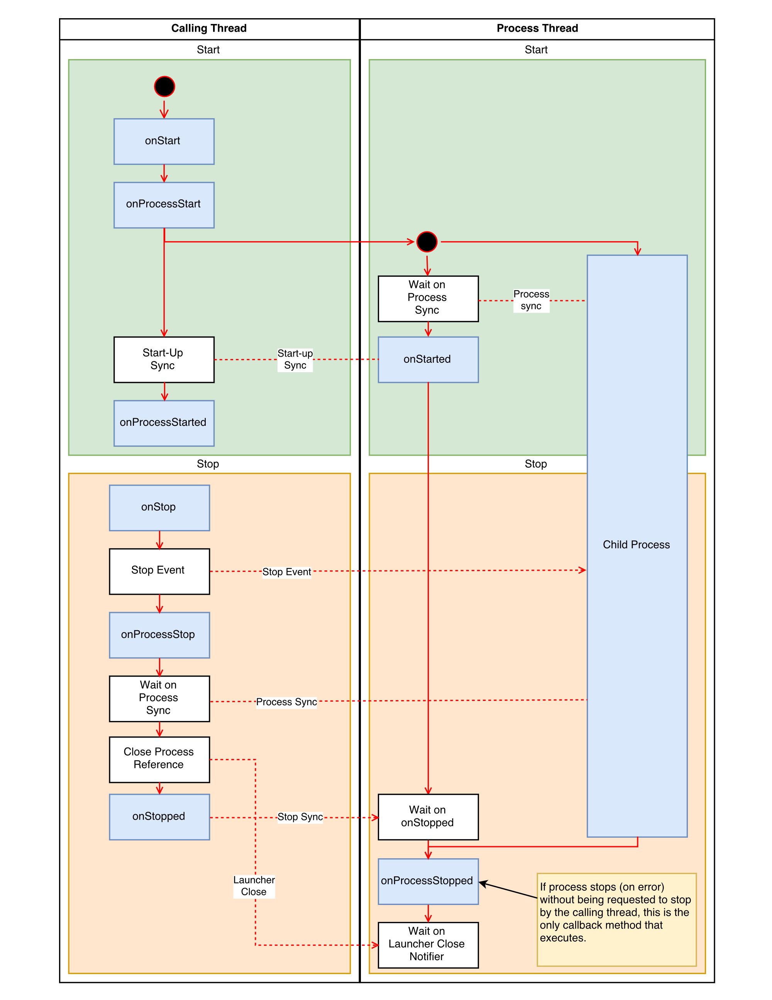

# Instrument Framework

[Overview](LevyLab-Instrument-Framework.pdf)

## Diagram 1

## Diagram 2

## Class Diagram

## SMO Lifecycle 1

## SMO Lifecycle 2

## SMO Reference

[Reference](LevyLab_SMO_Quick_Reference.pdf)
